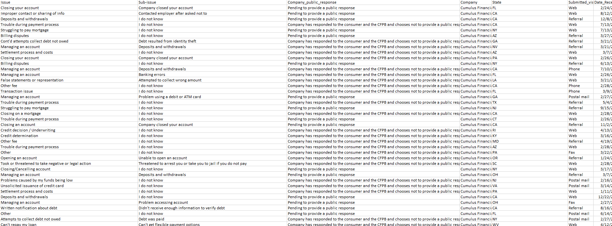

# Table of Contents
1. **Introduction**
2. **Overview Dashboard**
3. **Dataset**
4. **EDA-Financial-Consumer-Data Notebook**
5. **Usage**

# Intoduction
The project aims to analyze the Financial-Consumer dataset to derive insights and facilitate data-driven decision-making for anyone interested in data analysis and dashboards using Pyhton and Power BI.📈

# Overview Dashboard

This project addresses another businees problem In this context, I see myself as a data analyst employed at a news financial service company. The task involves visualizing data to help readers comprehend how countries have historically performed in Financial-Consuming.

**To resolve this business problem, I followed several steps:**

1. Cleaning data in kaggle notebook.
2. Exploratory Data Analysis (EDA) using Python.
3. Utilizing the KNN algorithm to predict the missing values.
4. Importing the output data to Power BI.
5. Writing DAX formulas to extract specific measures.
6. Building our final dashboard.

# Dataset

# EDA-Financial-Consumer-Data Notebook

**EDA and data cleaning**
1. Drop unnecessary columns
2. Replace some missing values
3. Remove duplicates
4. Replace messing values with predictive values using KNN algorithm
5. Use erangleing function
6. Upload the final data to Power BI

**Kaggle Notebook**
[EDA notebook](https://github.com/sahermuhamed1/Financial-Consumer-Data/blob/main/eda-financial-consumer-data.ipynb)

# Usage
Download the final dashboard from [Here]([./Pizza%20restaurant.pbix](https://github.com/sahermuhamed1/Financial-Consumer-Data/blob/main/FInancial%20consumer%20project.pbix)https://github.com/sahermuhamed1/Financial-Consumer-Data/blob/main/FInancial%20consumer%20project.pbix)

Download the dataset from [Here](https://github.com/sahermuhamed1/Financial-Consumer-Data/blob/main/Financial_Consumer_data111.csv)

Download the notebook from [Here]([https://github.com/sahermuhamed1/Financial-Consumer-Data/blob/main/Financial_Consumer_data111.csv](https://github.com/sahermuhamed1/Financial-Consumer-Data/blob/main/eda-financial-consumer-data.ipynb)https://github.com/sahermuhamed1/Financial-Consumer-Data/blob/main/eda-financial-consumer-data.ipynb)
